<div align="center">

<picture>
  <source media="(prefers-color-scheme: dark)" srcset="./assets/profile-hero/dark.svg">
  <source media="(prefers-color-scheme: light)" srcset="./assets/profile-hero/light.svg">
  
</picture>

[](https://www.linkedin.com/in/nuthdanai-w/)
[](https://www.quantseras.com/blog)
[](https://nutdnuy.medium.com/)
[](https://www.youtube.com/@NuthdanaiW)

</div>

## I build AI-native systems for investment research

I work at the intersection of quantitative finance, AI agents, and financial education. My GitHub is where I turn research papers, market data, and investment workflows into reproducible tools.

- Building agentic workflows for alpha research, portfolio analysis, and financial reporting.
- Developing practical tooling around WorldQuant BRAIN, QuantConnect, Thai SEC Open Data, and research-paper-to-code pipelines.
- Writing and teaching applied quant + AI workflows for investors, builders, and finance teams.

## Featured Projects

| Project | What it does | Start here if you care about |
|---|---|---|
| [quant-investment-papers](https://github.com/nutdnuy/quant-investment-papers) | Curated research library for alpha, factors, algorithmic trading, and portfolio management. | Finding serious papers faster. |
| [brain-paper-to-alpha-plugin](https://github.com/nutdnuy/brain-paper-to-alpha-plugin) | Claude Code / Codex plugin for turning papers into WorldQuant BRAIN alpha research workflows. | Agentic alpha research. |
| [sec-opendata-th](https://github.com/nutdnuy/sec-opendata-th) | Python client and agent plugin for Thailand SEC OpenAPI data. | Thai fund, NAV, factsheet, and SEC data automation. |
| [quantcoder-plugin](https://github.com/nutdnuy/quantcoder-plugin) | Agent-native wrapper for research-paper-to-QuantConnect workflows. | Moving from paper ideas to LEAN-style implementation. |
| [finrobot-plugin](https://github.com/nutdnuy/finrobot-plugin) | Claude Code / Codex adapter for FinRobot-style financial research and report generation. | Structured financial analysis workflows. |
| [self-driving-portfolio-skill](https://github.com/nutdnuy/self-driving-portfolio-skill) | Multi-agent strategic asset allocation workflow using macro data and portfolio research. | Portfolio construction with agentic research loops. |

## Current Focus

```text
Research papers -> alpha hypotheses -> reproducible experiments -> decision-ready analysis
```

- WorldQuant BRAIN alpha proposal pipelines.
- Research-paper-to-code systems for quant developers.
- AI-assisted investment research and reporting.
- Financial education products for Thai investors and AI builders.

## Toolbelt


## GitHub Snapshot

<p align="center">
  
  
</p>

## Connect

I am most interested in collaborations around quant research automation, AI agents for finance, market data tooling, and practical investor education.

- [LinkedIn](https://www.linkedin.com/in/nuthdanai-w/)
- [QuantSeras Blog](https://www.quantseras.com/blog)
- [Medium](https://nutdnuy.medium.com/)
- [YouTube @NuthdanaiW](https://www.youtube.com/@NuthdanaiW)
